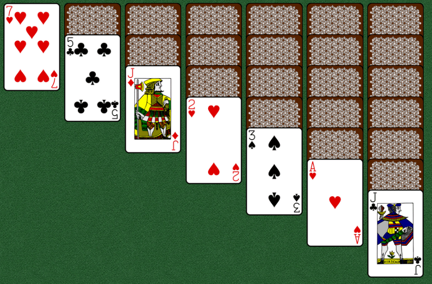
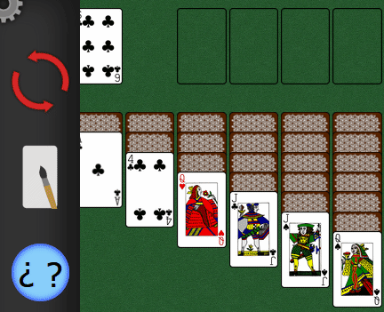

# solitaire
Welcome to my new project! This time I'm making something I wanted to create since I started learning about DOM methods: a classic klondike Solitaire. I've been prototyping a little before creating this repository, and I think I came with a good enough way to recreate this game.

## play the game:
# https://hectorvilas.github.io/solitaire/

## roadmap

### basics
- a new object will be created with the following:
- ✅ an array for stock
- ✅ an array for wastepile
- ✅ 4 arrays for foundations
- ✅ 7 arrays for tableau

### cards
- ✅ create an array with all the necessary cards (52)
- each card must be an object:
- ✅ objects must contain suit, number, color, isFlipped
- ✅ image url
- ✅ 1 will be ace card and number > 10 will be a court card, in code will still be a number

### DOM
- ✅ the play area will be divided in 2 rows and 7 columns
- the first row will contain:
- ✅ first cell for stock
- ✅ second cell for wastepile
- ✅ empty or info cell
- ✅ 4 cells for foundation
- the second row will contain:
- ✅ 7 tableaus

### starting a new game
- ✅ the cards array will be shuffled with `array.sort(random>0.5)`
- ✅ in the play area, the first card will be placed face down in the first tableau, the second tableau will receive 2 cards, the third one 3 cards... the last tableau will receive 7 cards
- ✅ a facing-up card will be placed in wastepile
- ✅ the remaining cards will be placed face down in the stock
- ✅ all the last cards on the tableau will be flipped automatically

### playing
- ✅ "mousedown" on facing down card will "flip" the card
- "mousedown" on facing up card will:
- ✅ store in "cardFrom" which cell has been pressed and the clicked card in that pile
- "mouseup" will:
- ✅ store in "cardDestination" which cell is under the mouse cursor and the last card in the pile
- ✅ run a function to check if the movement is valid
- ✅ clear the cadrFrom and cardDestination variables

- the validating function will:
- in tableaus the validating function:
- if cardFrom number == cardDestination number+1 && cardFrom color != cardDestination color:
- - ✅ remove last cards from the cardFrom column
- - ✅ add cardFrom card or cards to cardDestination
- ✅ in the foundations, the same will happen but with ascending numbers and only with same suit type
- check for win condition:
- ✅ if all same-suit piled up cards contains 13 cards, the game is over

### other ideas
- ❌ spanish card deck to replace design (won't do, there's nothing to pair in this kind of deck, like colors in the actual designs)
- ❌ button to switch language (english-spanish) (Unnecesary)
- ❌ sounds
- ✅ visual representation of options instead of text
- ❌ more game modes (this will be done in a new project someday)
- ❌ draw the cards with divs instead of using a full image for each one

# updates
> the play-area has been drawn with grid.

First time using grid, and I like how intuitive it is. [This guide](https://css-tricks.com/snippets/css/complete-guide-grid/) was really good to understand the basics, same with [this educational game](https://cssgridgarden.com/).

I've also been reading about Klondike on Wikipedia and learned how those spaces in the table are called, it will make the code more comfy to write and will look less ignorant if somebody reads it.

I'm a little nervous with this project, this is the first time I even think how I will make something like this. Will I success? The logic part will be challenging but I think I figured it out. The visual part will be more challenging, because I need to learn a lot more about `CSS`.

> card generator

This little piece of code will generate each necessary card and store them in an array.

```javascript
let suitsList = ["club", "diamonds", "spades", "hearts"]

for(let suitLoop = 0; suitLoop < 4; suitLoop++){
  for(let cardLoop = 1; cardLoop < 14; cardLoop++){
    let suit, number, color
    suit = suitsList[suitLoop]
    number = cardLoop
    
    suitLoop%2 === 0 ? color = "black": color = "red"
    
    let card = { suit, number, color, isFlipped: false }
    cards.push(card)
  }
}
```
> card shuffling and laying

After trying some stuff, I modified the original table object and replaced the pile1, pile2... pile7 keys with a simple 2D array, for better code. Thanks to this, I can place the cards in the tableau with a few lines of code:

```javascript
for(let i = 0; i < table.tableau.length; i++){
  let quantity = i;
  for (let j = quantity+1; j > 0; j--) {
    table.tableau[i].push(cards[0])
    cards.shift()
  }
}
```
This will place the corresponding cards in each tableau pile. For each card placed, the same card is removed from the deck, to prevent duplications.

> experimental function to place card names on table

I finally have something to show. I'm happy I made it work:


I wrote a function to visualize the name of the cards in the table. There's a lot of work to do, but at least now I can have something visual. Since it's going to be removed once the cards are drawn, here is the code fragment:

```javascript
function placeCardsDom(){
  table.stock.forEach(card => $stock.innerText += ` ${card.suit} ${card.number}`)
  $wastepile.innerText = ` ${table.waste[0].suit} ${table.waste[0].number}`
  for(let i = 0; i < table.tableau.length; i++){
    table.tableau[i].forEach(pile => {
      $tableaus[i].innerText += `${pile.suit} ${pile.number}\n`
    })
  }
}
```

> added divs for each tableau pile

> each card name is now placed on each division


> function to store moving card and destination card

> function to check if movement is valid

It was a little hard, but I managed to make a function to check if a movement is valid (or "legal"). This is how it works:
- when a space receives a "mousedown", it's card will be stored in an auxiliary variable
- same with "mouseup" but in another auxiliary variable
- if those two spaces have a card, another function will run to check movement validation

The movement will be valid if:
- the two cards are in different piles
- the destination card is the last card in the pile
- the dragged card is one number less than the destination card

Here is a little gif showing in console if the movement is valid:


It still needs to check if those two cards aren't the same color and if the destination card is flipped, but I think I can work with this as is and leave it for later.

The next step should be to move those cards when the validation function confirms that the move is valid.

> space creation moved to function

> detect valid card moves from pile to pile

I almost delete everything and start from scratch, because I forgot a few important things, like the cards don't only move from tableau pile to tableau pile! Also didn't find a way to place a child to all the other divs in the table, but after testing and testing found a way to make it work.

So I left the validation function alone and wrote another one to check if the card can be moved to another pile. If the movement is valid, it will show a message in the console. NOW is when I should check if the card can be moved over another.

The rules change depending the pile. Descending numbers on tableau, ascending numbers on foundation, moving out and not in from the waste pile, etc. This will be my next step, now that I can detect the kind of movement is being made.


> check if movement is valid based on number only

> depending the pile, the number must be one bigger or smaller

I think I'm figuring it out how to make all the checks. Maybe, instead of nesting `if`s or making it complicated to read with lots of conditions, I should use a few auxiliar variable to store the matches (number, color and suit) and then proceed to check those 3 values to determine if the card can finally be moved.

Here's a little demo, showing how the movements are valid or not based on numbers only:


> moved and adapted code from unnecesary function to another

> created another function to check all the neccesary conditions to allow movement

> color validation depending pile destination

> temporal facing down cards not showing it's content

> isFlipped condition to allow movement

The game received a few more conditions before allowing card movement. At this point I noticed how bad I started coding everything. Somethimes I'm adding stuff that should be applied before, and make it's implementation a little harder, or requires code rewriting. Another lesson learned: write down the problem solving before doing anything.

> image URL in cards

> exported card sheet as individual images

I downloaded a svg file with a full card deck.

Deck images by OpenClipart-Vectors from Pixabay ([url](https://pixabay.com/vectors/card-deck-deck-cards-playing-cards-161536/))

I'll give the proper credits to the author in the page itself when it's ready, also the same credits are inside the "resources" folder in CREDITS.txt with the svg file.

I may create my own cards in the future, depending on what I'm going to do with each card. If I want to animate them with rotations and other effects, making cards with divs doesn't feel like the proper way to do it. I think there's a function to convert divs and it's content to images, maybe it could be a better solution.

> function to place card images

> foundation cards now are shown

> flipped cards in tableau will appear facing up

> flip last card in tableau piles

I finally have something to see on screen, other than text.


Everything still works, but now I have a problem: the listeners are in the separations, not in the cards.

> card autoscale and hover style


> moved listeners from separators to cards

> (unused) function to hide separators without cards

> data attributes added to each card image

> click actions moved to cards

Now the cards are holding the necessary info to be the ones with listeners instead of the divisions. The game now is back to it's original state before adding images.


I can finally start writing the code to move the cards, this time for real.

I have two things to consider:
- the cards must move from an array to another, duplicating the moving ones and then deleting the originals from the other pile, as I did when laying the cards in the table.
- the page redrawing, because everything is considered in the code, not the DOM. So my idea is to just update the affected piles, or maybe I can find a way to just add or remove the cards that moved, without "refreshing" the entire pile. I'm not sure if it worth the "optimization", I still don't know about how heavy are some things in the code.

> background image applied (credits in ./resource/credits.txt)

> padding-bottom with card size to prevent overflowing

> allow card movement if empty space

> placeholder for empty piles

> code to move cards from pile to pile

Finally some interaction! I hate this code, but I don't want to rewrite everything again from scratch (maybe in the future). After struggling a little trying to understand my own code, I managed to do this:


This will move a single card, now I need to adjust the code to be able to move entire piles.

> stock-waste pile logic added

If there's cards in the stock pile, one will be moved to the waste pile. If there's none, the wastepile will go back to the stock. If both are empty piles, nothing happens.


> logic in foundation piles fixed

Confirmed: the code is a mess. I still find things breaking because it's not easy to read. Sometimes I'm not sure if i need to point to a pile or a specific place in the pile, this should be something easy to understand. At least this kind of game have very basic rules, so I can keep going.

I was thinking, I should rewrite the code for a future project, where I can change the game rules to make it possible to have more game modess. I think it would be much easier to do, and considering this from the problem solving stage will make things go smooth.

> animation to make tableaus fit on screen

No more ugly fixed empty spaces and no more instant space adjustement.


> empty spaces not animated

> piles can now be moved

Now it's possible to move more than one card. It wasn't hard, but randomizing the cards every time I make a change makes it difficult to test.


> temporal win condition

The game still don't have anything else in the page other than the table itself. I put an `alert()` to announce the game is won, will change to a custom prompt-like message in the future.

> double click function

> double click will move a card to any compatible foundation if possible.

Took me a while to figure it out but now it's possible to double click on a card and, if its an ace or there's already the same suit and it's number is one bigger, it will move to the corresponding foundation pile.


> gear button for menu drop

I drew a gear on InkScape to use as menu button, surprisingly the file itself can be shown in the page, so the button is a vectorial image.


I still don't know how I want the menu to look. My original idea was something visual, so it won't require text. I could make some frame per frame animation on InkScape and turn it into a gif with Gimp, with a minimalistic design, maybe. About the menu itself, I wanted to use a poker table railing image but can't find any with a top-down view.

> optimized code

I finally did something about the horrible code. I stored more info in the auxiliar variables, so now there's less need to repeat code to know where the cards come from or goes. The code could be much better if I had a better planning from the start. A big problem is having the piles in differente `key:value`s, so I need to always check the name of the pile and then I know which one is the one that receives the changes, something that I can't (or don't know) store in the auxiliar variables.

Before doing such big change, I created a branch (first time doing it on a personal project). It was easy, but I don't like how Github won't track my contributions untill I merge with the main branch. Nobody asked me for it, but I want to see every day contributions, I want to know how active I was each day.

> image url moved outside card object

Now I will be able to change card design "in the fly". All the url info is now outside the cards and in the DOM redraw function. Won't be necessary to restart the game. I still need to find new designs and maybe draw my owns.

> russian deck images

I downloaded a vectorial sheet with a soviet/russian deck design and converted each one to a new image, like I did with the first deck. Now I only have to change a variable name and call the `redrawCards()` function to change the design without restarting the game, thanks to the previous change.

I still need to create an option to swap design, but I don't have an options menu yet.



> new restart and design buttons

Now the player can restart the game without refreshing the page. Also the card style can be swapped now. Those buttons are temporal.

> responsiveness

The margin at the sides of the play area was too big when the screen was too narrow, so I added a little responsiveness with `CSS`' `@media`. The cards will adjust it's size too, same with the play area's height.

> partially implemented drag and drop

This was so hard to implement, I was thinking about it while trying to sleep the last night. First I wrote a way to drag the card itself, but it broke a lot of things. Then I though I should have an invisible div following the mouse cursor all the time and, while the left click is held, hide the original card, duplicate it's image and size in viewport and then unhide the div, so it looks like the card from the pile is being moved. The old switcheroo in action.


Now I should do the next:
- don't drag empty spaces
- don't drag facing down cards (maybe I should remove their listeners)
- create separators in the div so I can show more than a single card moving
- remove the original card transition so it won't be noticed how it gets hidden
- drag the card from the same coordinates it gets clicked (so it won't instantly move to bottom right)

Once everything is working, I want to animate it, like not instantly following the cursor, or maybe getting a little rotation while dragged from side to side.

**thoughts:** I should continue with the frontend course, but holy cow, making a personal project is so addictive. At least I'm learning a lot of things by myself about `JavaScript`.

> the entire pile is moved when dragging

I finally managed to do this. When a card is dragged, it will check how many cards are on top of it, create the necessary separators in an invisible div, copy the cards' url and then show this div and hide the cards in the table, so it looks like those are being dragged.

Empty spaces and facing down cards won't be dragged.


> prevent dragging empty spaces

> cards are dragged while holding click only when mouse moves

> card dragged from the same object coordinates

Now the card is grabbed from where it was clicked, instead of moving it's corner to the cursor.


> function to check for duplicated cards

This is just a debugging tool I made because some cards became duplicated. The problem is already fixed (double click ignored if the card was facing up, messing with the cards), but in case some cards get duplicated (replaced by a copy or added) or a card goes missing, it will show a message in console.

> dragged cards uses same sepration from table cards

Just for consistency, now the dragged cards have the same space in between as the rest, even after rescaling the window.

> prompt menu and about


I made a card-like prompt for all the credits. Now the authors of the resources I used are credited there, not only in a TXT file.

> images for menu buttons


> stock pile now looks like a pile of cards

Don't having an idea how much cards are left in the stock is annoying, so I did this little change. The more cards are in the stock, the bigger it will look.


> move dragged cards to the corner of the cursor


> when dragging a card, it will show the card under or an empty space


> function to preload all deck images

An invisible div will receive every single card image as child so it will be preloaded, preventing cards "blinking" if it's not yet downloaded.

I'm not sure if having this div is a heavy memory load, so it will be emptied one second later.

```HTML
<div id="preload" class="hidden"></div>
```

```javascript
function preloadImages(){
  const $preload = document.querySelector("#preload")
  for (let i = 0; i < 2; i++) {
    deck.forEach(card => {
      let img = document.createElement("img")
      let url = `./media/images/cards/${deckDesign}/`
      img.src = `${url}${card.suit}${card.number}.png`
      $preload.appendChild(img)
    })
    
    i === 0 ? deckDesign = "russian" : deckDesign = "traditional"
  }
  setTimeout(() => {
    $preload.innerHTML = ""
  }, 1000);
}
```

> new game animation



> restarting the game now hides the menu bar

> win message


---

## Final Update:
This will be the last update, at least for now. While I enjoy working on this project and learn new tricks with JavaScript, it is consuming the time I could spend learning more from the course.

I was going to levate it as finished, but I forgot I had an alert placeholder for the win message. The new one is not as fancy as I wanted, but is enough for now. I hope I don't abandon the project in the future and can go back to it to animate the cards when the player wins, something like in the Solitaire from Windows 3.1 with the falling and bouncing cards.

# Thanks for playing!
---
---
---

> only K cards can move to empty tableau piles

A friend told me this some days ago, only the higher card can move to empty spaces in the bottom piles. Whoops! He's right. This is why the game was so easy.

I was trying to avoid spending time with personal projects to spend more time with the frontend course, but I can't leave the game like this, with a huge fault, so I came back to it.

Luckily it was an easy fix. I tried to add some more code for this, but after reading again how I wrote the code for the rules, I noticed I already had an `if` for empty piles. I just added an extra condition.

Now, time to go back to learning.